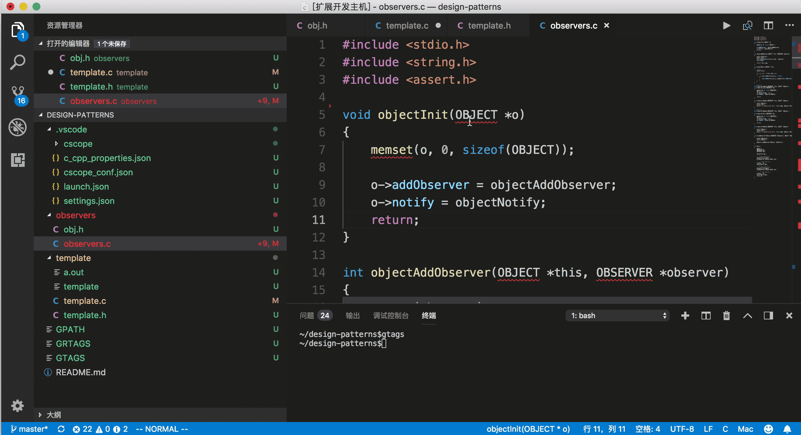

# autoincludecpp README

当c/c++出现未定义符号时，弹出quickfix自动添加头文件

## Features

当c/c++出现未定义符号时，弹出quickfix自动添加头文件

> Tip: 如果出现多个则会弹出列表由用户选择

## Requirements

需要安装gnu global,并设置环境变量,可以执行`global --version`判断命令是否安装成功
